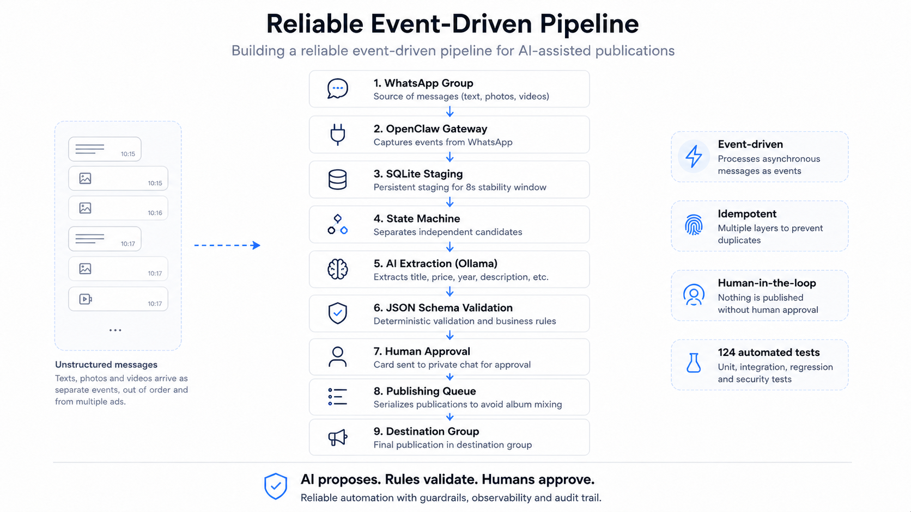

# WhatsApp Listing Pipeline

An event-driven automation pipeline that turns sequences of WhatsApp text and
images into structured listings while keeping a human in control of every
publication.



> AI proposes. Deterministic rules validate. A human approves.

## What this project solves

Marketplace groups commonly receive batches in this format:

```text
listing A text
listing A photos
listing B text
listing B photos
...
```

WhatsApp delivers text, photos, and videos as independent events. Callbacks may
arrive late or out of order, multiple listings may be submitted concurrently,
and network failures may leave delivery status uncertain.

This project:

- accepts events from one explicitly authorized source group;
- stages events in SQLite during a stability window;
- restores the original timestamp order;
- separates candidates through a state machine;
- attaches subsequent images to the correct candidate;
- extracts title, year, price, description, category, and type with Ollama;
- validates structured output with JSON Schema and business rules;
- asks for clarification in a private chat when recoverable data is missing;
- sends a private review card that includes the image count;
- publishes only after individual human approval;
- serializes album delivery to prevent images from being mixed;
- prevents duplicates with hashes, IDs, locks, and checkpoints.

## Secure by default

The public repository contains no real phone numbers, JIDs, group names,
tokens, listings, or media. Its example configuration starts with:

- `DRY_RUN=true`;
- source-group intake disabled;
- personal and group publication disabled;
- marketplace integration disabled;
- empty destinations and allowlists.

All WhatsApp content is treated as untrusted data. AI output can never authorize
publication, and a reaction in the source group never counts as approval.

## Architecture

```text
Source group
      ↓
OpenClaw / WhatsApp
      ↓
SQLite staging (8-second stability window)
      ↓
Ordering + state machine
      ↓
Independent candidates
      ↓
Ollama → structured JSON
      ↓
JSON Schema + deterministic rules
      ↓
Private review card
      ↓
👍 approve | 👎 cancel | ambiguity requests clarification
      ↓
Serialized queue → publication group
```

Concurrency, idempotency, and trust boundaries are described in
[ARCHITECTURE.md](ARCHITECTURE.md).

## Requirements

- Linux;
- Python 3.11 or newer;
- a Node.js version compatible with your OpenClaw release;
- OpenClaw with the WhatsApp channel configured;
- Ollama with a model capable of structured JSON output;
- SQLite 3 for optional operational inspection.

The text extraction flow does not require an external AI API. It uses the model
served by the configured Ollama installation.

## Quick start

Clone the repository and prepare a private local configuration:

```bash
git clone https://github.com/Rodericuss/auto-publication-romildonegocios.git
cd auto-publication-romildonegocios
scripts/bootstrap-local-config
```

The bootstrap command:

1. creates `.env` from `.env.example`;
2. creates `config/settings.local.json` from the secure public example;
3. applies mode `600` to private files;
4. creates `config/settings.json -> settings.local.json` for compatibility;
5. never silently overwrites existing configuration.

Validate the defaults before editing them:

```bash
scripts/validate-local-config
scripts/validate-local-config --public-example
```

## Configuration layers

The application uses two local files. Both are excluded from Git:

| File | Purpose |
|---|---|
| `.env` | Endpoints, model, feature flags, chats, groups, and token |
| `config/settings.local.json` | Keyword catalog and structured configuration |

Environment variables override JSON values. Configuration files are resolved in
this order:

1. `IMPORTER_SETTINGS_PATH`;
2. `config/settings.local.json`;
3. `config/settings.json`, the legacy compatibility fallback;
4. `config/settings.example.json`, always secure and destination-free.

The loader reads `.env` without replacing variables already present in the
process or systemd service environment.

## Configuring AI extraction

The current extraction path supports models served by Ollama. Configure it in
`.env`:

```dotenv
OLLAMA_PROVIDER=ollama
OLLAMA_ENDPOINT=http://127.0.0.1:11434
OLLAMA_EXTRACTION_MODEL=qwen3-agent
OLLAMA_TIMEOUT_SECONDS=120
```

### Available AI parameters

| Variable | Example | Effect |
|---|---|---|
| `OLLAMA_PROVIDER` | `ollama` | Provider supported by the current extractor |
| `OLLAMA_ENDPOINT` | `http://127.0.0.1:11434` | Ollama server used for extraction |
| `OLLAMA_EXTRACTION_MODEL` | `qwen3-agent` | Text model loaded through Ollama |
| `OLLAMA_TIMEOUT_SECONDS` | `120` | Maximum extraction wait time |
| `REDACTED_TERMS` | `Example Company,Example Seller` | Terms removed from and rejected in descriptions |

To change the model safely:

1. install or pull the model in Ollama;
2. change only `OLLAMA_EXTRACTION_MODEL`;
3. run the automated tests;
4. submit synthetic listings with all write flags disabled;
5. inspect prices, years, categories, and types before enabling a real target.

The extractor uses zero temperature, a fixed seed, and JSON Schema to reduce
variation. Its output is still subject to deterministic validation and human
approval.

### Accepted item keywords

The initial filter uses `item_keywords` from `config/settings.local.json`:

```json
{
  "item_keywords": [
    "tractor",
    "excavator",
    "backhoe",
    "truck"
  ]
}
```

Keywords must match the language used in the source group. Add them
conservatively: generic terms increase the risk of turning ordinary
conversations into listing candidates.

### Visual validation

Visual validation does not participate in the operational decision. It was
removed because vision models incorrectly rejected valid cabin, dashboard,
component, and interior-detail photos. Images are attached to listings; videos
are ignored.

## Configuring chats and groups

One installation supports:

- one or more explicitly allowed personal chats;
- one source group;
- one publication group, different from the source;
- one personal chat for clarification and approval.

Use synthetic IDs in versioned examples and store real values only in `.env`:

```dotenv
OPENCLAW_PERSONAL_CHAT_ID=5500000000000
OPENCLAW_ALLOWED_CHAT_IDS=5500000000000

SOURCE_GROUP_ENABLED=true
SOURCE_GROUP_SHADOW_MODE=true
SOURCE_GROUP_NAME=SOURCE GROUP
SOURCE_GROUP_JID=100000000000000001@g.us
APPROVAL_CHAT_ID=5500000000000

GROUP_PUBLICATION_ENABLED=true
GROUP_PUBLICATION_CHANNEL=whatsapp
PUBLICATION_GROUP_NAME=PUBLICATION GROUP
PUBLICATION_GROUP_JID=100000000000000002@g.us
```

These numbers are synthetic. A group JID must end in `@g.us`.

### Mandatory rules

- `APPROVAL_CHAT_ID` must be present in `OPENCLAW_ALLOWED_CHAT_IDS`;
- source and publication groups must have different JIDs;
- a group name grants no permission: authorization compares exact JIDs;
- the source group receives no automated replies or reactions;
- only the matching private review card can authorize a candidate;
- never use a wildcard to accept unknown groups.

This command fails before startup if any of these rules is inconsistent:

```bash
scripts/validate-local-config
```

### Aligning the OpenClaw configuration

The `.env` file configures the importer, but OpenClaw's WhatsApp channel must use
the same allowlist. The minimum expected structure is equivalent to:

```json
{
  "channels": {
    "whatsapp": {
      "dmPolicy": "allowlist",
      "allowFrom": ["5500000000000"],
      "groupPolicy": "allowlist",
      "groupAllowFrom": ["*"],
      "groups": {
        "100000000000000001@g.us": {
          "requireMention": false
        }
      },
      "ackReaction": {
        "group": "never"
      }
    }
  }
}
```

`groupAllowFrom` restricts who may send messages inside an already allowlisted
group; it does not expand the `groups` allowlist. The importer remains limited
to the exact source JID.

The OpenClaw plugin must receive equivalent values:

```json
{
  "projectRoot": "/absolute/path/to/the/project",
  "allowedChatIds": ["5500000000000"],
  "dryRun": false,
  "groupIntake": {
    "enabled": true,
    "groupJid": "100000000000000001@g.us",
    "approvalChatId": "5500000000000",
    "shadowMode": true
  }
}
```

All values above are synthetic. Never commit a real OpenClaw configuration or
WhatsApp/Baileys authentication state.

### Changing groups safely

1. stop new event intake while changing the configuration;
2. back up `.env`, `settings.local.json`, and the OpenClaw configuration;
3. update source, approval, and destination values in both layers;
4. confirm that source and destination are different;
5. run `scripts/validate-local-config`;
6. run the automated test suite;
7. test with `SOURCE_GROUP_SHADOW_MODE=true` first;
8. enable publication only after reviewing cards, images, and checkpoints.

For multiple source groups, prefer isolated instances with independent
configuration and staging databases. This implementation deliberately limits
each instance to one source JID so its trust boundary remains auditable.

## Publication flags

```dotenv
DRY_RUN=true
PERSONAL_PUBLICATION_ENABLED=false
GROUP_PUBLICATION_ENABLED=false
MARKETPLACE_ENABLED=false
MARKETPLACE_VISIBLE=false
```

Change one write guard at a time. The public example configuration never allows
writes.

When `MARKETPLACE_ENABLED=false`, an approved listing may follow the no-site
flow without a URL. To enable an internal marketplace API, configure:

```dotenv
MARKETPLACE_ENABLED=true
MARKETPLACE_INTERNAL_URL=http://127.0.0.1:4000
MARKETPLACE_API_PATH=/api/internal/imported-products
MARKETPLACE_DRY_RUN_ONLY=true
MARKETPLACE_VISIBLE=false
MARKETPLACE_INTERNAL_API_TOKEN=
MARKETPLACE_FLY_APP=
```

The token must exist only in the environment or in `.marketplace-token` with
mode `600`.

## Usage

After configuring the plugin and WhatsApp channel:

1. send listing text and photos to the source group;
2. wait for the stability window;
3. receive the review card in the private approval chat;
4. verify its title, price, type, and image count;
5. answer the clarification question if one is pending;
6. react with 👍 to publish or 👎 to cancel.

A candidate awaiting approval does not block subsequent candidates.

## States and checkpoints

Each candidate stores private files under `anuncios/pendentes/<uuid>/`, such as:

- `mensagem-original.txt`;
- `metadata.json`;
- `anuncio-extraido.json`;
- `clarification.json`;
- `status.json`;
- `whatsapp-group-album-publication.json`;
- images and SHA-256 hashes.

A `complete/sent` delivery must never be repeated. A failed delivery may be
retried only when its checkpoint proves that no message ID was issued and that
the failure happened before provider acceptance.

## Runtime data

Git tracks only `.gitkeep` files in these directories:

```text
anuncios/recebendo/
anuncios/pendentes/
anuncios/processados/
anuncios/descartados/
anuncios/erros/
```

Never convert a real listing package into a fixture. Tests use entirely
synthetic listings, phone numbers, JIDs, images, and IDs.

## Tests

Run the complete suite:

```bash
python3 -m unittest discover -s tests -v
```

Additional checks:

```bash
scripts/validate-local-config --public-example
python3 -m compileall -q src tests scripts
node --check openclaw/plugins/whatsapp-marketplace-importer/index.js
git diff --check
```

The current checkpoint contains 124 unit, integration, regression, and security
tests.

## Project structure

```text
config/       schemas, catalog, and secure public configuration
openclaw/     integration plugin and skill
scripts/      operational commands and validation tools
src/          ingestion, staging, extraction, queue, and publication
tests/        automated tests and synthetic fixtures
anuncios/     private runtime data excluded from Git
docs/assets/  public README assets
```

## Current limitations

- only images are attached to listings; videos are ignored;
- each instance supports one source group;
- visual validation is disabled;
- marketplace integration starts disabled;
- OpenClaw upgrades may require album and reaction patches to be revalidated;
- production use requires monitoring the gateway and publication checkpoints.

## Security

Do not open a public issue containing a real token, phone number, JID, group
name, listing, media file, or log. Follow the process in
[SECURITY.md](SECURITY.md).

## License

Distributed under the [MIT License](LICENSE).
